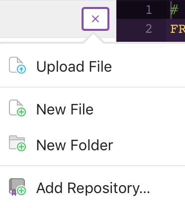

This guide will teach you how to use Runnable's Dockerfile mode. Unlike Simple Mode, Dockerfile mode lets you store your configuration in a Dockerfile template.

## Understanding Runnable's Dockerfile Build Context

To use your Dockerfile, you need to refactor it to match the directory structure of Runnable’s build folder.

The Dockerfile is on the same level as any additional files and folders—this includes your repository.
Make sure you format your Dockerfile to add the repository:

Any other additional files/folders/repositories you need can be added by clicking [+] button in file explorer.

For example, lets say you added a new file called “testing.txt” to your build folder.

To add “testing.txt” to your container, you have to format your Dockerfile to have the following lines:

If you need help in setting up your Dockerfile, please contact support. We are here to help!
